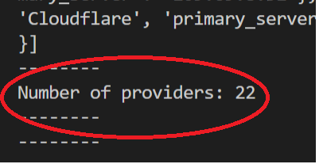

## Unit 3 Homework Assignment: Intro to Python Programming 

In this homework assignment, you will be using the concepts you've learned in class to complete the below two activities. 


---
## DNS Dictionary

As a network admin, you've been given a list of DNS server IPs and their providers in two separate lists. Your company needs these in an accessible form in order to verify the DNS server IP and provider together in case malware alters company machines' IP configurations to use a rogue DNS server.

In order to look up a DNS server IP using the provider name, you'll need to build a way to put that information together, similar to a phone book.

Your goal is to build different data structures for easily accessing information associated with these DNS properties.

### Instructions

Open up the `Unsolved/DNSDictionary.py` file. For each step, accomplish the following:

1. Use a `for` loop to create a dictionary mapping the provider names to their IPs.

   - For example, two entries in the dictionary would look like:

        ```python
        {
            'Level3': '209.244.0.3',
            'Verisign': '64.6.64.6'
        }
        ```

   - Print Hurricane Electric's IPs using the dictionary.

2. Use a `for` loop to create a list of dictionaries with the associated information.

   - For example, two entries in the list would look like:

        ```python
        [
            {
                'provider_name': 'Level3',
                'primary_server': '209.244.0.3'
            },
            {
                'provider_name': 'Verisign',
                'primary_server': '64.6.64.6'
            }
        ]
        ```
   - Print the total number of providers using the list.

### Bonuses

3. Use a `for` loop to update your dictionary from part 1 with the new IPs.

   - For example, two entries in the dictionary would look like:

        ```python
        {
            'Level3': ['209.244.0.3', '209.244.0.4'],
            'Verisign': ['64.6.64.6', '64.6.65.6']
        }
        ```

   - The IPs should be in the form of an array of IPs.

   - Print Google's IPs using the dictionary.


4. Use nested `for` loops to update the list from part 2 with a `'secondary_server'` key.

   - For example, two entries in the list would look like:

        ```python
        [
            {
                'provider_name': 'Level3',
                'primary_server': '209.244.0.3',
                'secondary_server': '209.244.0.4'
            },
            {
                'provider_name': 'Verisign',
                'primary_server': '64.6.64.6',
                'secondary_server': '64.6.65.6'
            }
        ]
        ```

5. Super Bonus: use the `pprint` module to print the dictionary and list more elegantly. This will take a lot of research, but we will cover this in a future class.

---

## UserAdmin

When you buy a new home WiFi router, it typically comes with one admin login and password to access settings via the product's website. If you don't have this admin password, you're unable to change things like the WiFi network name and password. 

In this activity, you'll use Python to build a login system for a WiFi router that only allows those with admin credentials to log in.

### Instructions

1. Open up `Unsolved/UserAdmin.py`.

2. Create a function named `getCreds` with no parameters that will prompt the user for their username and password. This function should return a dictionary called `userInfo` that looks like the dictionaries below:

```python
# Administrator accounts list
adminList = [
    {
        "username": "DaBigBoss",
        "password": "DaBest"
    },
    {
        "username": "root",
        "password": "toor"
    }
]
```

3. Create a function named `checkLogin` with two parameters: the `userInfo` and the `adminList`. The function should check the credentials to see if they are contained within the admin list of logins. The function should set a variable `loggedIn` to `True` if the credentials are found in the admin list, and set the variable to `False` otherwise.

Now that we know how to check to see if a user is logging in with admin credentials, let's set up the part of the system that will continue to prompt the user for their username and password if they didn't enter correct admin credentials before. 

4. Create a `while` loop that will continue to call `getCreds` and `checkLogin` until a user logs in with admin credentials. 

5. After each call of `checkLogin` in the `while` loop, print to the terminal the string `"---------"`.

6. Once the user logs in with admin credentials, print to the terminal the string `"YOU HAVE LOGGED IN!"`.

3. Run the code often as you write and test individual functions with correct and incorrect admin credentials to make sure you're on the right path!
